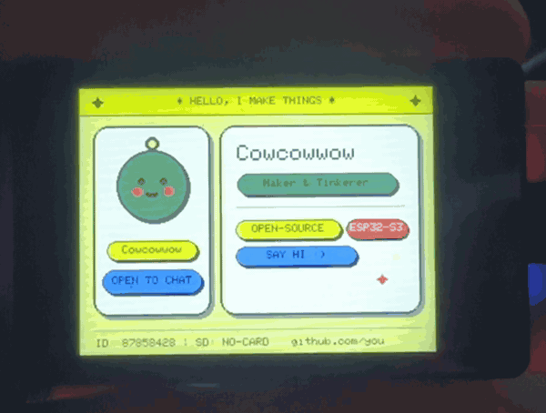

# Nametag Studio

**Build your own programmable name badge — by talking to an AI agent.**

A 2-inch screen you clip to a lanyard that shows your name, your role, your status, and blinks at people. You customize it by editing one plain-text config file, or by asking Claude Code, Codex, Antigravity, or Cursor to edit it for you.

No prior embedded experience needed. If you can copy a command into a terminal, you can build this.

<p align="center">
  
</p>

<p align="center"><em>Running on real hardware &mdash; the default config, straight out of <code>git clone</code>.</em></p>

---

## What you need

| Item | Description |
|---|---|
| **Board** | Waveshare ESP32-S3-Touch-LCD-2 (2.0″ 320×240 IPS) · ~$25 |
| **Cable** | USB-C **data** cable — not a charge-only cable |
| **Computer** | macOS, Linux, or Windows (WSL) |
| **Optional** | microSD card (FAT32) — to display custom photos or logos |
| **Optional** | Small battery + lanyard strap — to wear it on the go |

No soldering. No breadboard. Nothing to wire.

---

## Quick start

```bash
git clone https://github.com/mommocmoc/esp32-nametag-studio.git
cd esp32-nametag-studio

./tools/setup.sh          # Installs the toolchain (takes a couple minutes on first run)
```

Open `nametag/config.h` and edit the text between the quotes:

```c
#define NAMETAG_NAME     "Cowcowwow"
#define NAMETAG_ROLE     "Maker & Tinkerer"
#define NAMETAG_ORG      "Cowcowwow"
#define NAMETAG_STATUS   "OPEN TO CHAT"
```

Plug in the board and flash it:

```bash
./tools/flash.sh
```

That's the entire loop: edit, flash, and enjoy.

---

## Doing it with an AI agent instead

This repository is designed from the ground up to be operated by a coding agent. `AGENTS.md` explicitly defines what the agent may modify and what it must leave untouched, ensuring it updates your badge info without refactoring your firmware.

Open this folder in **Claude Code**, **Codex**, **Antigravity**, or **Cursor** and try prompts like:

> Set up this project and make sure it compiles on my machine.

> Update the badge to say Jun Park, Product Designer at Northwind. Set status to "ask me about typography". Use the midnight theme.

> My name is 김민준 — make the badge display it in Korean.

> The role text is getting clipped on screen. Adjust the layout to fit.

> Add a sixth theme using this palette: #1a1a2e #16213e #0f3460 #e94560

The agent reads `AGENTS.md`, edits `nametag/config.h`, runs `./tools/build.sh` to verify compilation, and lets you know when it's ready to flash. More prompt ideas are in [`docs/AGENT_PROMPTS.md`](docs/AGENT_PROMPTS.md).

---

## Customization

Everything you need to configure lives in **`nametag/config.h`**. It's documented line by line — no C/C++ background required.

- **Text** — name, role, organization, status message, header banner, three sticker tags, and footer.
- **Themes** — five built-in themes available via `NAMETAG_THEME`:

| Theme | Mood |
|---|---|
| `THEME_KITSCH_POP` | Butter yellow, sage, peach. Playful and vibrant. *(default)* |
| `THEME_MIDNIGHT` | Navy, cyan, magenta. High contrast for dark venues. |
| `THEME_MONO_INK` | Newsprint black-and-white with signal red accents. Editorial feel. |
| `THEME_CANDY` | Bubblegum, mint, lilac. Soft pastel aesthetic. |
| `THEME_TERMINAL` | Pure black screen with phosphor green text. Classic hacker vibe. |

To create a new theme, copy an existing palette block in `nametag/theme.h`. You can convert brand HEX colors using `python3 tools/rgb565.py "#ff7e9e"`.

- **Animations** — three independently toggleable animations: avatar blinking/winking, corner sparkles twinkling, and status pill bobbing. All three run at a smooth 50 FPS.
- **Brightness & Rotation** — dim the display to save battery during conferences, or rotate 180° to match your lanyard orientation.

---

## Names in any language (Korean, Japanese, Chinese, etc.)

The microcontroller's built-in font only supports ASCII characters. Non-Latin scripts (Korean, Japanese, Chinese, Cyrillic, Greek, Arabic, emoji, etc.) will not render from raw string literals and fail silently without an error.

To display non-Latin names, generate a high-resolution bitmap on your computer:

```bash
pip3 install pillow
python3 tools/make_name_bitmap.py "김민준" --size 28 --preview
```

The `--preview` flag prints ASCII art of the rendered glyphs in your terminal so you can verify the output before uploading to hardware:

```
  preview (71x25):
  ..........##..........................##...##.......#######......##....
  ..........##.............###########..##...##....................##....
  ..........##............############..##...##....#############...##....
  ...
```

Then set `USE_NAME_BITMAP` to `true` in `config.h` and flash.

This works for any language and script supported by your system fonts (`"こんにちは"`, `"Привет"`, `"مرحبا"`, `"ΑΛΕΞ"`, etc.).

---

## Custom photos and logos (microSD)

You can load custom images using a FAT32-formatted microSD card.

```bash
pip3 install pillow
python3 tools/prepare_image.py selfie.jpg --slot avatar
```

This helper script resizes the image to 64×64 and applies a circular transparent mask so it fits inside the keyring frame. Copy `assets/sd-card/*` to the root of your microSD card, insert it into the board, and enable the avatar slot in `config.h`:

```c
#define IMAGE_SLOT_AVATAR   { true, "/avatar.png",  26,  46,  64,  64 }
```

Four slots are supported: full-screen background, avatar, sticker, and mini icon. Full PNG alpha transparency is supported for custom cutouts.

No microSD card is a fully supported state, not an error. The badge falls back to the procedural UI and displays `SD: NO-CARD` in the footer.

---

## Useful commands

| Command | Description |
|---|---|
| `./tools/setup.sh` | Install toolchain and dependencies (safe to re-run) |
| `./tools/build.sh` | Compile firmware locally without hardware connected |
| `./tools/flash.sh` | Compile and upload to the board (auto-detects port) |
| `./tools/monitor.sh` | View serial output log at 115200 baud |
| `./tools/doctor.sh` | Diagnose environment and connection issues |
| `./tools/verify.sh` | Verify compilation across all themes and name modes |

---

## Troubleshooting

- **Board not detected**: 90% of the time, this is a cable issue. Charge-only USB-C cables look identical to data cables. Try a different cable, then run `./tools/doctor.sh`.
- **Upload fails or hangs**: Put the board into bootloader mode manually: hold **BOOT**, tap **RESET**, release **BOOT**, and re-run `./tools/flash.sh`.
- **Text is clipped**: The display uses fixed-width fonts. Recommended character budgets: role ≤ 22 chars, org ≤ 13, status ≤ 14, name ≤ 13. Shorten the text or widen the pill in `nametag/layout.h`.
- **Screen stays blank**: Check the serial monitor with `./tools/monitor.sh`. If you see `[LCD] init FAILED`, check your board definition. If there is no output, inspect the cable and power source.
- **`INTELSHORT` redefinition warnings**: Expected upstream compiler warnings caused by overlapping macro names between image decoding libraries. Harmless and safe to ignore.

For additional help, see [`docs/TROUBLESHOOTING.md`](docs/TROUBLESHOOTING.md).

---

## Project structure

```
nametag/
  config.h        ← User configuration (edit this file)
  theme.h         ← Color palette definitions
  layout.h        ← Screen coordinates and bounding boxes
  nametag.ino     ← Core rendering engine
  name_bitmap.h   ← Generated bitmap for non-Latin names
tools/            ← Setup, build, flash, monitor, and generator scripts
docs/             ← Hardware specs, customization guides, agent prompts
assets/sd-card/   ← Assets ready to copy to a microSD card
AGENTS.md         ← Operational contract for AI coding agents
```

Separation of concerns: text in `config.h`, colors in `theme.h`, and positioning in `layout.h`. Animation clear-rectangles derive directly from the element layout macros, so updating coordinates in `layout.h` automatically keeps animations aligned.

---

## Documentation

- [`docs/AGENT_PROMPTS.md`](docs/AGENT_PROMPTS.md) — Ready-to-use AI agent prompts
- [`docs/CUSTOMIZE.md`](docs/CUSTOMIZE.md) — Creating themes, customizing layouts, adding elements
- [`docs/HARDWARE.md`](docs/HARDWARE.md) — Pinouts, hardware specifications, porting notes
- [`docs/TROUBLESHOOTING.md`](docs/TROUBLESHOOTING.md) — Detailed troubleshooting guide

🇰🇷 **한국어 안내서: [README.ko.md](README.ko.md)**

---

## License

MIT License. Build badges for your team, distribute them at conferences, or customize them with your own branding.

Powered by [Arduino_GFX](https://github.com/moononournation/Arduino_GFX), [PNGdec](https://github.com/bitbank2/PNGdec), and [JPEGDEC](https://github.com/bitbank2/JPEGDEC).
